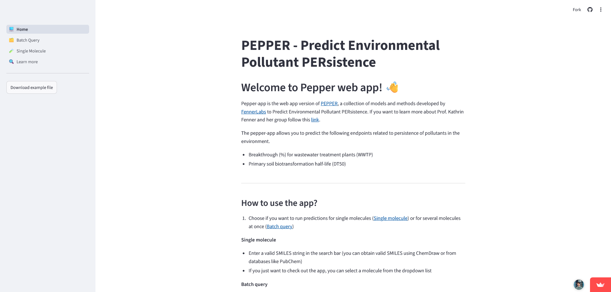
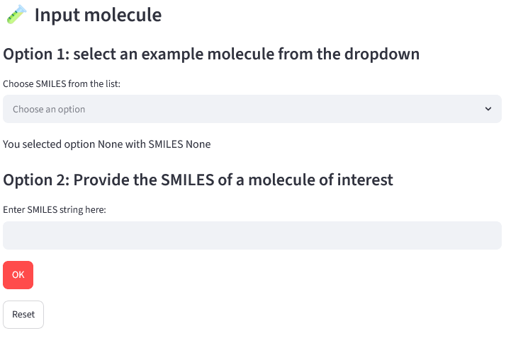
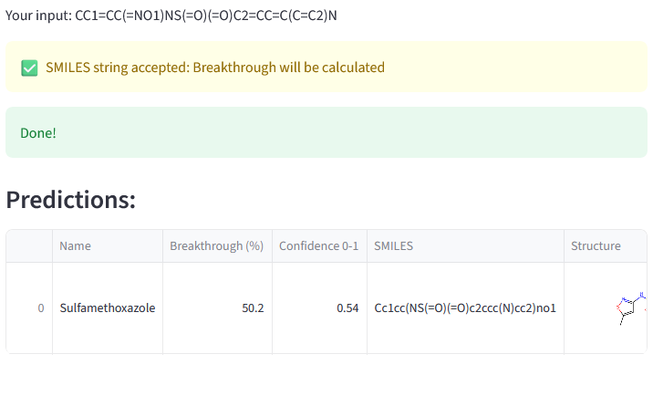
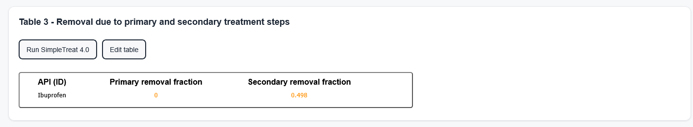

## Preparation

Please download the following Excel file. The file includes the necessary data for the following exercises and a template to store the results of the exercises. If not done so previously, please also download the API example template provided on the ePiE webpage and load it into ePiE as described under "How to: The ePiE App - API properties".

[Workshop Template](API_workshop_template.xlsx){: .md-button download="API_GAM_Workshop"}

## Exercise 1: SimpleTreat vs. PEPPER

ePiE stands out for its high degree of customizability. Most parameters can be overwritten, allowing users to use experimental data or other models.
In this exercise, we will compare SimpleTreat to the PEPPER (Predict Environmental Pollutant PERsistence
) model, which is freely accessible as a web application via the following [link](https://pepper-app.streamlit.app/). More information on the PEPPER model can be found under the web application or in its respective publication by [Cordero Solano et al. 2025](https://pubs.acs.org/doi/full/10.1021/acs.est.5c09314).

To use PEPPER, please follow the points outlined below:

1. Go to the PEPPER website
2. Click on "Single Molecule" (Figure 1)

    
    <figcaption>Figure 1</figcaption>

3. Choose "WWTP breakthrough" as endpoint to predict (Figure 2)

    
    <figcaption>Figure 2</figcaption>

4. Choose one of the example chemicals, such as Sulfamethoxazole (Option 1), or provide the SMILES (Option 2) (Figure 3) 
5. Click "OK" (Figure 3)

    
    <figcaption>Figure 3</figcaption>

PEPPER calculates the breakthrough (%) of a compound, which is the fraction of a compound that is *not* removed (Figure 4). ePiE, however, requires the removed fraction. Accordingly, the breakthrough needs to be converted to the removed fraction. PEPPER also provides a confidence metric and results close to 0 should be used with care!

 

<figcaption>Figure 4</figcaption>
 

The calculated removal fraction by PEPPER can be included in ePiE under the "WWTP removal" tab. For this, edit the table and set either the primary or secondary removal fraction to 0[^1], and include the PEPPER value in the other removal fraction, as exemplified below in Figure 5 for sulfamethoxazole.

[^1]: Do not leave the cell empty as this will prevent ePiE from running.

 

<figcaption>Figure 5</figcaption>
 

### Exercise 1: Instructions

Please compare the results using the default SimpleTreat and the PEPPER model using the instructions below:

1. Predict the breakthrough for ibuprofen and acetaminophen as calculated by PEPPER and convert the results to the removed fraction
2. Apply the default properties in ePiE under the "API properties" tab
3. Compare the removal fractions of both compounds from SimpleTreat and the PEPPER model under the "WWTP removal" tab
4. Select the Ouse (Yorkshire) and the Rhine 1 basin for average yearly flow conditions under the "River basin" tab
5. Assume a consumption of 1 g/capita/year for the year 2019 under the "Consumption data" tab
7. Compare the predicted concentrations for both compounds and river basins under the "Output statistics" tab

## Exercise 2: Consumption Data

Data on API consumption is crucial in driving ePiE's model outcomes. However, specific data might be difficult to obtain for individual APIs and countries. To address these issues, we refer to the PREMIER guidance document 4 (In prep.), which describes different approaches for predicting consumption data. 

In this exercise, we are going to investigate how detailed consumption data can help refine ePiE's model outputs. For this, we are using data from [Cannata et al. (2024)](https://www.sciencedirect.com/science/article/pii/S0160412023006529?via%3Dihub) and from Oldenkamp et al. (In prep).

### Exercise 2: Instructions

Please assess the predicted concentrations for ibuprofen using the instructions below:

1. Use the default API-parameters for Ibuprofen under the "API properties" tab
2. Use SimpleTreat under the "WWTP removal" tab
3. Select the Ouse (Yorkshire) and the Rhine 1 basin for average yearly flow conditions under the "River basin" tab
4. Use once 8.6 g/capita/year and once (<mark>**UK DATA**</mark>) as consumption data for the year 2019 under the "Consumption data" tab
5. Compare the predicted concentrations under the "Output statistics" tab for both river basins

## Exercise 3: Excretion Factors

Next to removal rates and consumption data, the excreted fraction of an API after administration is a critical and sensitive parameter driving the model results. Data on excretion, also referred to as elimination, can normally be found in the summary of product characteristics (SmPCs), which outlines how to use the medicine safely including maximum dosage, potential side effects, and also data on metabolism. Nevertheless, reported excretion rates may differ between different sources. In this exercise, we will assess the influence of this parameter for ibuprofen.

### Exercise 3: Instructions

1. Adjust the default parameter of ibuprofen for its excreted fraction (f_uf) under the "API properties" tab
    2. The default parameter for f_uf is 0.2
    3. Change f_uf to 0.1
         1. Reported values range between 0.1 - 0.3 according to [^2][^3]
    4. Change f_uf to 1.0  
2. Use SimpleTreat under the "WWTP removal" tab
3. Select the Ouse (Yorkshire) basin for average yearly flow conditions (default) under the "River basin" tab
4. Use (<mark>**UK DATA**</mark>) as consumption data for the year 2019 under the "Consumption data" tab
5. Compare the predicted concentrations for the three excretion fractions (e.g., f_uf = 0.1; 0.2; 1) under the "Output statistics" tab
  

[^2]: https://www.medicines.org.uk/emc/product/7020/smpc
[^3]: https://pdf.hres.ca/dpd_pm/00025353.PDF

## Exercise 4: Excretion and Removal Rates

The previous exercises demonstrated how individual model input parameters and uncertainty around these can substantially influence the model outcomes. This exercise will assess the influence of two parameters in combination: Excretion and removal rates. For this, we will assume a worst-case scenario, i.e. full excretion and no removal.

### Exercise 4: Instructions

1. Adjust the default parameter of ibuprofen for its excreted fraction (f_uf) under the "API properties" tab
    2. Change f_uf to 1.0 
2. Set both removal fractions to 0 under the "WWTP removal" tab 
3. Select the Ouse (Yorkshire) basin for average yearly flow conditions (default) under the "River basin" tab
4. Use (<mark>**UK DATA**</mark>) as consumption data for the year 2019 under the "Consumption data" tab
5. Compare the predicted concentrations against the predicted concentrations to the results from exercises 2 & 3 

## Exercise 5: Comparison to Conventional Exposure Assessments

Predicting environmental concentrations can be achieved by multiple ways. The most conventional and conservative approach follows the equation below: 

$$
PEC_{SW} = \frac{\text{Administered Dose} \times \text{Market Penetration}}{\text{Wastewater Volume} \times \text{Dilution}}
$$

This approach represents a conservative scenario, assuming no removal inside WWTP and complete excretion of the administered dose. Only the market penetration factor, by default 0.01, is used to adjust the dose. The default values for the wastewater volume are 200 L and 10 for the dilution factor. In this exercise, we are going to apply the conventional approach and compare it to our previous results. It should be noted that this conventional approach cannot be directly replicated as ePiE accounts for the population size per basin and assumes individual wastewater volumes and dilution factors based on its underlying data.

### Exercise 5: Instructions 

1. Adjust the default parameter of ibuprofen for its excreted fraction (f_uf) under the "API properties" tab
    2. Change f_uf to 1.0 
2. Set both removal fractions to 0 under the "WWTP removal" tab 
3. Select the Ouse (Yorkshire) basin under the "River basin" tab
    1. Select average yearly flow conditions (default) 
    1. Select minimum yearly flow
4. Use 4.38[^4] g/capita/year as consumption data for the year 2019 under the "Consumption data" tab
5. Compare the predicted concentrations against the results from exercises 2 and 3 and per hydrological scenario.

[^4]: 1.2 g is the maximum daily dose of ibuprofen; 1.2 g * 0.01 * 365 days = 4.38 g/capita/year

